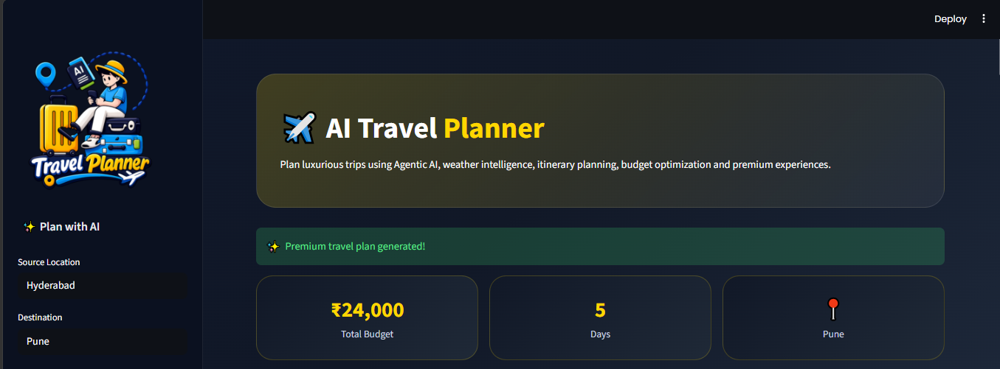
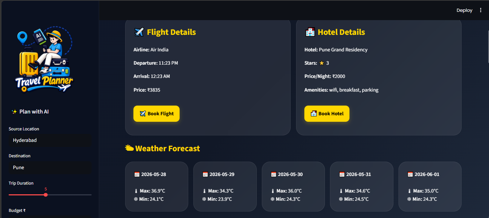
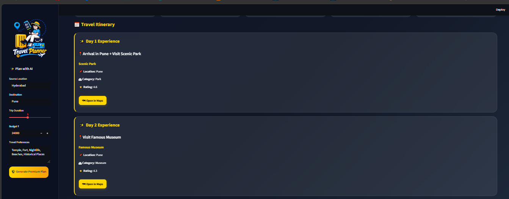
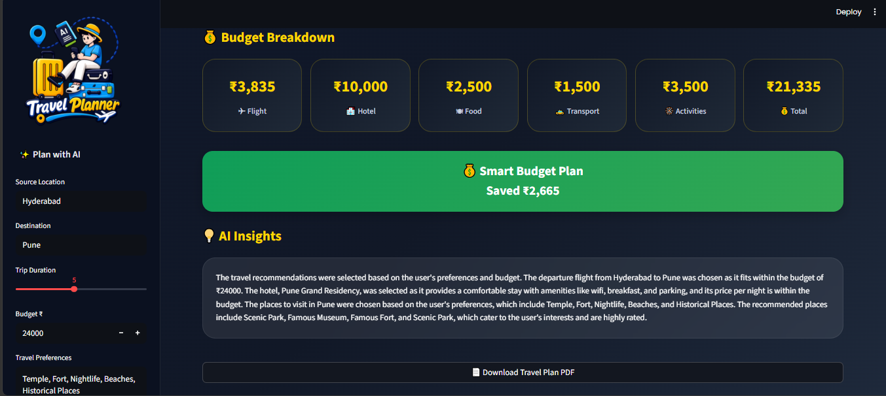

# 🌍 Agentic AI-Based Travel Planning Assistant Using LangChain

An intelligent **AI-powered Travel Planner** built using **LangChain, Groq LLM, Streamlit, and Agentic AI** that autonomously generates personalized travel itineraries based on **budget, weather, flights, hotels, attractions, and user preferences**.

---

## 🚀 Project Overview

Planning a trip often requires visiting multiple websites to compare flights, hotels, weather, and attractions. This project solves that problem using an **Agentic AI system** that reasons like a travel expert and creates an optimized travel itinerary automatically.

The system uses **LangChain Tools + LLM reasoning** to:

- Search flights
- Recommend hotels
- Discover tourist attractions
- Fetch live weather forecasts
- Estimate travel budget
- Generate day-wise itinerary
- Provide AI reasoning for recommendations

---

## ✨ Features

### 🤖 Agentic AI Workflow
- LangChain-based autonomous travel agent
- Multi-step reasoning & intelligent decision making
- Tool-calling architecture

### ✈ Flight Recommendation
- Cheapest flight recommendation
- Budget-aware flight selection
- Dynamic Google Flight booking recommendation
- Flight timing details

### 🏨 Hotel Recommendation
- Hotel filtering by rating & budget
- Amenities display
- Dynamic Google Hotel booking recommendation

### 📍 Smart Tourist Place Discovery
- Preference-based place recommendation
- Filters attractions by category:
  - Temple
  - Historical
  - Nightlife
  - Beaches
  - Luxury
- Google Maps integration for places
- Open place directly in Maps

### 🌤 Live Weather Forecast
- Real-time weather using **Open-Meteo API**
- Multi-day forecast
- Max & Min temperature tracking

### 💰 Smart Budget Optimization
Budget calculation includes:

- Flight Cost
- Hotel Cost
- Food Expenses
- Local Transport
- Activities Cost

Additional Smart Features:

✅ Budget Saved Indicator  
✅ Budget Exceeded Alert  
✅ Premium Budget Dashboard

### 📅 Smart Travel Itinerary
- Day-wise travel planning
- Personalized itinerary generation
- Preference-aware recommendations

### 🧠 AI Insights
- AI-generated travel reasoning
- Explains recommendation logic
- Budget & preference-based decisions

### 📄 PDF Download
- Download full travel itinerary as PDF
- Includes:
  - Flights
  - Hotel
  - Weather
  - Budget
  - Itinerary
  - AI Insights

### 🎨 Premium UI Experience
- Modern Streamlit dashboard
- Custom logo branding
- Sidebar AI planner UI
- Loading animations
- Premium travel cards

---

## 🛠 Tech Stack

| Technology | Usage |
|------------|-------|
| Python | Core Programming |
| Streamlit | Frontend UI |
| LangChain | Agentic Workflow |
| Groq LLM | AI Reasoning |
| Open-Meteo API | Live Weather |
| JSON Dataset | Flights, Hotels, Places |
| ReportLab | PDF Generation |

---

## 📂 Project Structure

```txt
Agentic-AI-Travel-Planner/
│── agent/
│   └── langchain_agent.py
│
│── tools/
│   ├── flight_tool.py
│   ├── hotel_tool.py
│   ├── places_tool.py
│   ├── weather_tool.py
│   └── budget_tool.py
│
│── utils/
│   ├── helper.py
│   └── pdf_generator.py
│
│── data/
│   ├── flights.json
│   ├── hotels.json
│   └── places.json
│
│── app.py
│── requirements.txt
│── .env
│── README.md
```

---

## ⚙️ Installation & Setup

### 1️⃣ Clone Repository

```bash
git clone <your-github-repo-link>
cd Agentic-AI-Travel-Planner
```

### 2️⃣ Create Virtual Environment

```bash
python -m venv venv
```

Activate environment:

#### Windows
```bash
venv\Scripts\activate
```

### 3️⃣ Install Dependencies

```bash
pip install -r requirements.txt
```

### 4️⃣ Configure Environment Variables

Create `.env` file:

```env
GROQ_API_KEY=your_api_key_here
```

### 5️⃣ Run Streamlit App

```bash
streamlit run app.py
```

---

## 📸 Project Output

### Features Included
✅ Flight Recommendation  
✅ Hotel Recommendation  
✅ Weather Forecast  
✅ Budget Breakdown  
✅ Personalized Travel Preferences  
✅ Google Maps Integration  
✅ Dynamic Booking Links  
✅ PDF Download  
✅ AI Insights  
✅ Agentic AI Reasoning

---

## 📌 Business Use Cases

- Travel Agencies
- Airline Aggregators
- Tourism Platforms
- Personalized Trip Planning
- AI Travel Assistant Systems

Companies like **MakeMyTrip, Booking.com, Ixigo, and ClearTrip** are adopting similar AI-driven travel assistants.

---

## 📸 Screenshots

### 🏠 Home Page


---

### ✨ Generated Travel Dashboard


---

### ✈ Flight, Hotel & Weather Recommendation


---

### 📍 Travel Itinerary


---

### 💰 Budget & AI Insights


## 🎯 Future Enhancements

- Real-time Flight APIs
- Live Hotel Booking APIs
- Multi-city Trip Planning
- Voice-based Travel Assistant
- Authentication & User History

---

## 👨‍💻 Author

**Vinay Pandey**  
MCA Graduate | Full Stack Developer | AI Enthusiast

---

## ⭐ If you liked this project

Give this repository a **star ⭐** on GitHub.